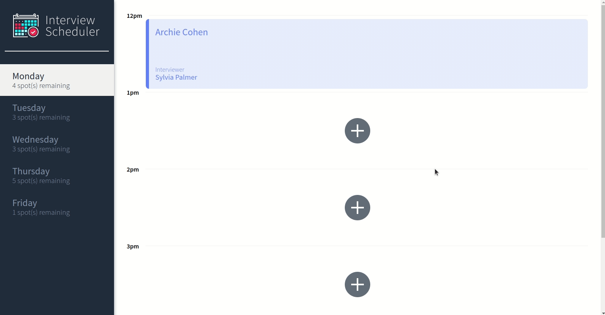
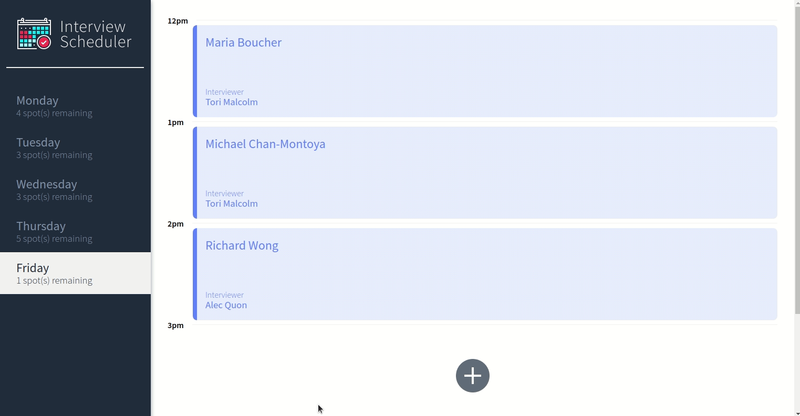
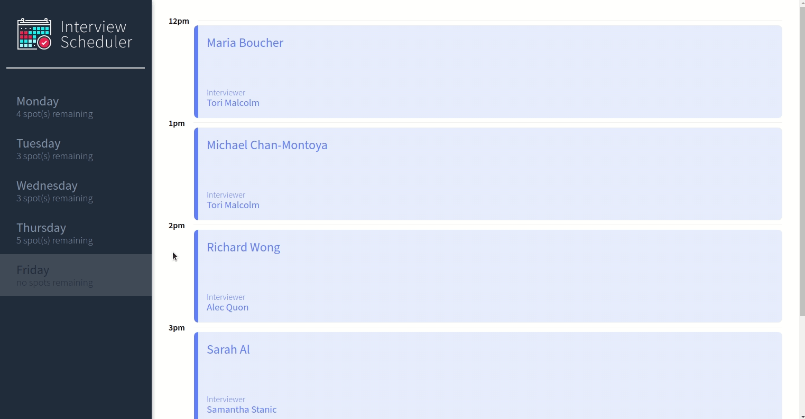
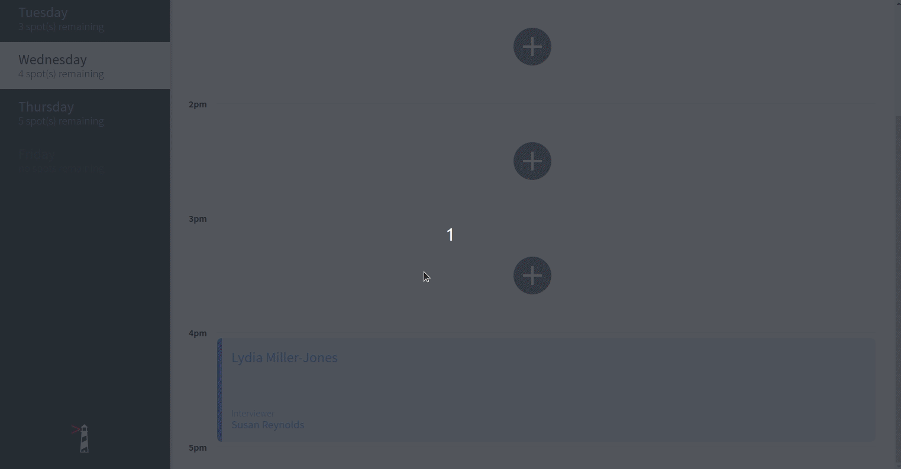

# Interview Scheduler

## Final Product
- Clip of Application

- Clip of Adding an interview

- Clip of Deleting an interview

- Clip of Editing an interview


## Setup

Install dependencies with `npm install`.

## Running Webpack Development Server

```sh
npm start
```

## Running Jest Test Framework

```sh
npm test
```

## Running Storybook Visual Testbed

```sh
npm run storybook
```
## Server API
available at https://github.com/AreejOmBas/scheduler-api